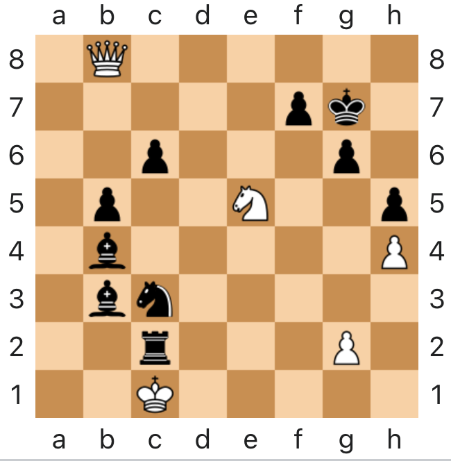
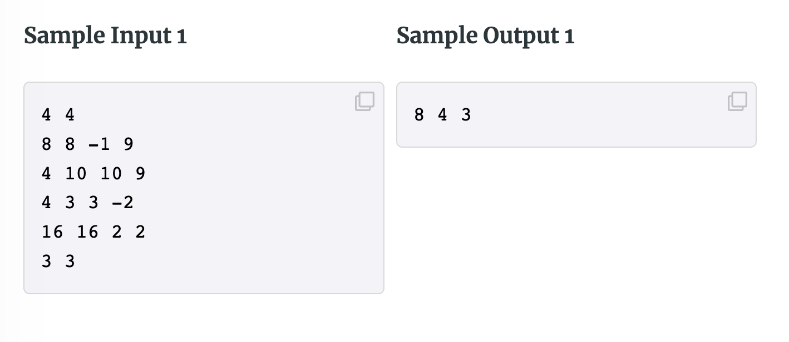

# Competitive Programming

Learn the fun way

---

# Pahlevi Fikri Auliya

AVP of Engineering at Ruangguru

@\_fikri_auliya

---

# Day to Day Programming

- As a user, I want to login to my account
- As a user, I want to register to the system
- As a user, I want to see my profile
- As a user, I want to see my friends
- As a user, I want to see my friend's profile

---


---

# You will be bored

---

## Let's make it fun again


---

# Competitive Programming

---

## What is that?

---

Competitive Programming is a **mind sport**, involving participants trying to program according to provided specifications.

---

## FUN!

---

### Sudoku


---

### Maze


---

### Chess



---

### Math


---

Why do we solve these problems?
Because **it's fun!**

---

So does **Competitive Programming!**

---




---

Why do we code these problems?

- Do we get paid?
- Is it going to be used by end users?

---

No, because it's **fun!**

---

# Tips #0: Fun Mindset

---

Given this

```python
names = ["John", "Mary", "John", "John", "Sherlock", "Sherlock"]
```

How to remove duplicates?

---

```python
for i in range(len(names)):
    for j in range(i + 1, len(names)):
        if names[i] == names[j]:
            names.pop(j)
```

---

That's `O(n^2)`!

And the code is long!

---

```python
names = set(names)
```

> `set` is a data structure with unique elements

---

If we now `set` data structure,
we can simplify the way we solve

---

Now, how to find the most frequent name?

```python
names = ["John", "Mary", "John", "John", "Sherlock", "Sherlock"]
```

---

Build a frequency table

| Name     | Count |
| -------- | ----- |
| John     | 3     |
| Mary     | 1     |
| Sherlock | 2     |

---

```python
tables = [[]]
for name in names:
    found = False
    for table in tables:
        if table[0] == name:
            table[1] += 1
            found = True
            break
    if not found:
        tables.append([name, 1])
```

---

Such a long code!
And it's `O(n^2)`!

---

```python
freq = {}
for name in names:
    if name in freq:
        freq[name] += 1
    else:
        freq[name] = 1
```

> Hashmap is a data structure that maps a key to a value

---

If we now `hashmap` data structure,
we can simplify the way we solve

---

# Tips #1: Learn Data Structures

---

# Tips #2: Ask why?

---

# Tips #3: Visualize

---

# Tips #4: Practice

---

# Tips #5: Compete!

---
